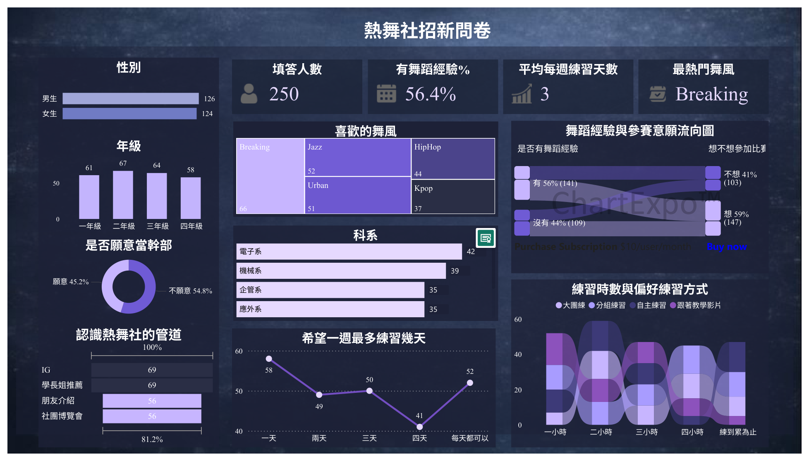

# powerbi-dance-club-survey
A Power BI dashboard analyzing dance club recruitment survey data.
#  Dance Club Recruitment Survey Dashboard

A Power BI dashboard analyzing dance club recruitment survey data.

「熱舞社招新問卷」是資料視覺化課程期末專題，
透過 Power BI 將社團招新問卷資料轉換成視覺化儀表板，
分析填答者基本輪廓、舞風偏好、練習習慣、招新來源，
以及舞蹈經驗與參賽意願之間的關係。

---

##  Dashboard Preview

---

##  Project Overview

本專題使用 250 份熱舞社招新問卷資料進行分析。

主要分析內容包括：

- 性別與年級分布
- 科系分布
- 舞蹈經驗比例
- 舞風偏好
- 幹部參與意願
- 每週可接受的練習天數
- 招新資訊來源
- 練習時數與練習方式
- 舞蹈經驗與參賽意願之間的關係

---

##  Key Findings

- Survey responses: **250**
- Respondents with dance experience: **56.4%**
- Average preferred practice frequency: **3 days per week**
- Most popular dance style: **Breaking**

---

##  Visualizations

The dashboard includes:

- KPI Cards
- Bar Charts
- Column Charts
- Donut Chart
- Treemap
- Funnel Chart
- Line Chart
- Ribbon Chart
- Sankey Diagram

---

##  Tools

- Microsoft Power BI
- Data Visualization
- DAX Measures
- Data Transformation

---

##  Project Files

- [`dashboard.pbix`](dashboard.pbix) — Power BI project file
- [`report.pdf`](report.pdf) — Project report
- `powerbi-dashboard-preview.png` — Dashboard preview image

---

##  Purpose

The dashboard was designed to help understand potential dance club members and provide references for recruitment, activity planning, practice scheduling, and competition training.
